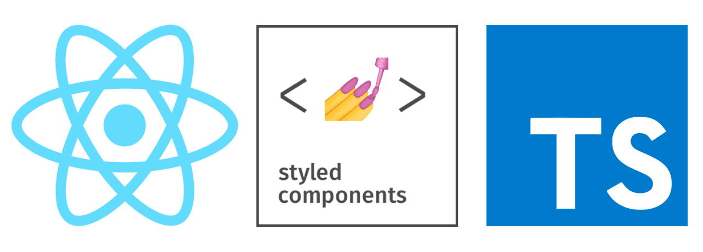

# Portfolio Website Overhaul

I decided to rework my own **[web-site](https://uvanov.com)**.

### Used technologies

### About it 

Well, i know that my web-site should combine two features:

> 1. Informative Value - for companies, which want invite me to work
> 2. Examples of my work (portfolio) - for people, who want to offer something as to freelance worker. 

Design... It caused a lot of problems. 
I like neon and space websites stylistic, but also i needed make this 
website comfortable to use, and not to steal user's focus from important blocks. 

I hope i did that :D 